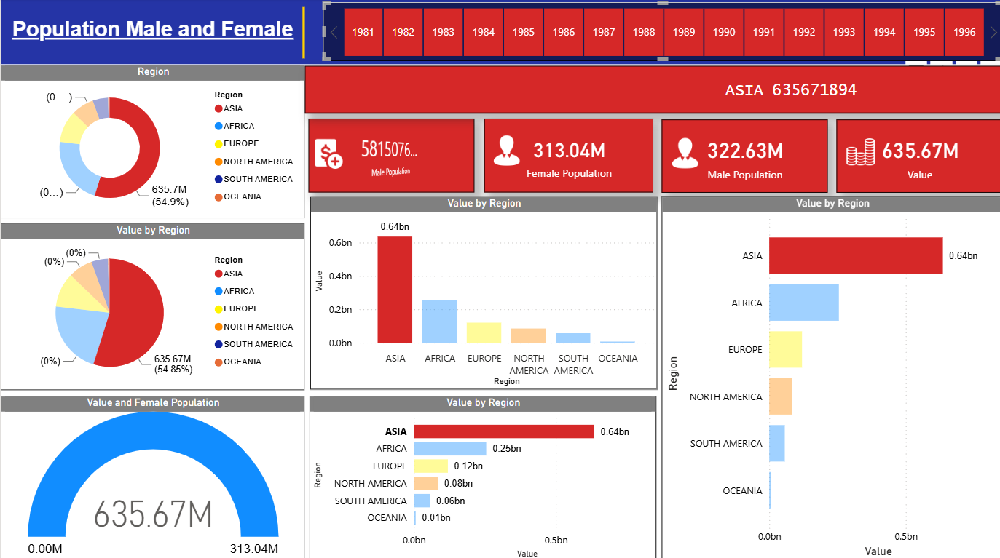

# World Population Dashboard

An interactive Power BI dashboard that visualizes global population data across regions, tracking male and female population share, regional distribution, and year-wise trends.

## Overview

This dashboard breaks down world population data by region (Asia, Africa, Europe, North America, South America, Oceania), surfacing:

- **Regional population share** — donut and pie charts showing each region's percentage of total population
- **Gender split** — male vs. female population figures, both as KPI cards and a gauge visual
- **Year-wise filtering** — a horizontal slicer to filter the entire dashboard by year
- **Regional comparison** — bar charts ranking regions by population value, viewed both vertically and horizontally
- **Headline KPI banner** — top region and its total population value front and center

## Dataset

`World_Population_Dataset.csv` contains country-level population data, including:

| Field | Description |
|---|---|
| CCA3 | ISO 3166-1 alpha-3 country code |
| Name | Country name |
| 2022, 2020, 2015, 2010, 2000, 1990, 1980, 1970 | Historical population figures by year |
| Area (km²) | Total land area |
| Density (per km²) | Population density |
| GrowthRate | Annual population growth rate |
| World Population Percentage | Country's share of world population |
| Rank | Global population rank |

## Tools & Process

- **Power Query** — cleaned and transformed the raw country-level data, mapping countries to regions
- **Data Modeling (DAX)** — built measures for regional aggregation, gender-based population estimates, and percentage-of-total calculations
- **Power BI Desktop** — designed the report layout, visuals (donut/pie charts, bar charts, KPI cards, gauge chart), and the year slicer for interactive filtering

## Files in this repo

- `dashboard_screenshot.png` — screenshot of the finished dashboard
- `World_Population_Dataset.csv` — source dataset used to build the report
- `README.md` — this file

---
*Built by Md Reyaz Ahmad as a personal data analysis project.*
